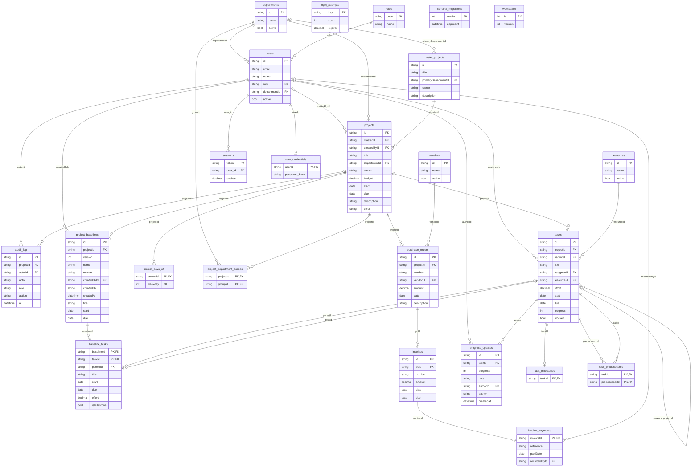

# BIA entity relationship diagram

Source of truth: production/database.py. For an offline graphical view open BIA_ERD.html.

```mermaid
erDiagram
    direction TB
    departments {
        string id PK
        string name
        bool active
    }
    login_attempts {
        string key PK
        int count
        decimal expires
    }
    resources {
        string id PK
        string name
        bool active
    }
    roles {
        string code PK
        string name
    }
    schema_migrations {
        int version PK
        datetime appliedAt
    }
    vendors {
        string id PK
        string name
        bool active
    }
    workspace {
        int id PK
        int version
    }
    master_projects {
        string id PK
        string title
        string primaryDepartmentId FK
        string owner
        string description
    }
    users {
        string id PK
        string email
        string name
        string role FK
        string departmentId FK
        bool active
    }
    projects {
        string id PK
        string masterId FK
        string createdById FK
        string title
        string departmentId FK
        string owner
        decimal budget
        date start
        date due
        string description
        string color
    }
    sessions {
        string token PK
        string user_id FK
        decimal expires
    }
    user_credentials {
        string userId PK,FK
        string password_hash
    }
    audit_log {
        string id PK
        string projectId FK
        string actorId FK
        string actor
        string role
        string action
        datetime at
    }
    project_baselines {
        string id PK
        string projectId FK
        int version
        string name
        string reason
        string createdById FK
        string createdBy
        datetime createdAt
        string title
        date start
        date due
    }
    project_days_off {
        string projectId PK,FK
        int weekday PK
    }
    project_department_access {
        string projectId PK,FK
        string groupId PK,FK
    }
    purchase_orders {
        string id PK
        string projectId FK
        string number
        string vendorId FK
        decimal amount
        date date
        string description
    }
    tasks {
        string id PK
        string projectId FK
        string parentId FK
        string title
        string assigneeId FK
        string resourceId FK
        decimal effort
        date start
        date due
        int progress
        bool blocked
    }
    baseline_tasks {
        string baselineId PK,FK
        string taskId PK,FK
        string parentId FK
        string title
        date start
        date due
        decimal effort
        bool isMilestone
    }
    invoices {
        string id PK
        string poId FK
        string number
        decimal amount
        date date
        date due
    }
    progress_updates {
        string id PK
        string taskId FK
        int progress
        string note
        string authorId FK
        string author
        datetime createdAt
    }
    task_milestones {
        string taskId PK,FK
    }
    task_predecessors {
        string taskId PK,FK
        string predecessorId PK,FK
    }
    invoice_payments {
        string invoiceId PK,FK
        string reference
        date paidDate
        string recordedById FK
    }
    departments o|--o{ master_projects : "primaryDepartmentId"
    departments ||--o{ users : "departmentId"
    roles ||--o{ users : "role"
    users o|--o{ projects : "createdById"
    departments ||--o{ projects : "departmentId"
    master_projects ||--o{ projects : "masterId"
    users ||--o{ sessions : "user_id"
    users ||--o| user_credentials : "userId"
    users o|--o{ audit_log : "actorId"
    projects o|--o{ audit_log : "projectId"
    users ||--o{ project_baselines : "createdById"
    projects ||--o{ project_baselines : "projectId"
    projects ||--o{ project_days_off : "projectId"
    departments ||--o{ project_department_access : "groupId"
    projects ||--o{ project_department_access : "projectId"
    projects ||--o{ purchase_orders : "projectId"
    vendors ||--o{ purchase_orders : "vendorId"
    users o|--o{ tasks : "assigneeId"
    tasks o|--o{ tasks : "parentId,projectId"
    projects ||--o{ tasks : "projectId"
    resources ||--o{ tasks : "resourceId"
    project_baselines ||--o{ baseline_tasks : "baselineId"
    tasks o|--o{ baseline_tasks : "parentId"
    tasks ||--o{ baseline_tasks : "taskId"
    purchase_orders ||--o{ invoices : "poId"
    users o|--o{ progress_updates : "authorId"
    tasks ||--o{ progress_updates : "taskId"
    tasks ||--o| task_milestones : "taskId"
    tasks ||--o{ task_predecessors : "predecessorId"
    tasks ||--o{ task_predecessors : "taskId"
    invoices ||--o| invoice_payments : "invoiceId"
    users o|--o{ invoice_payments : "recordedById"
```
